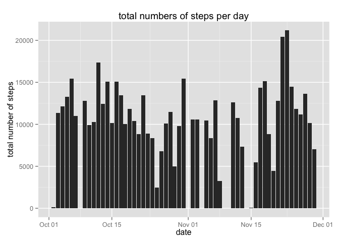
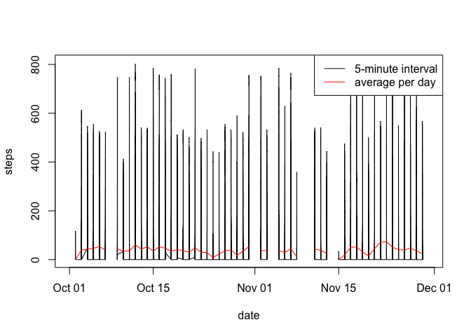
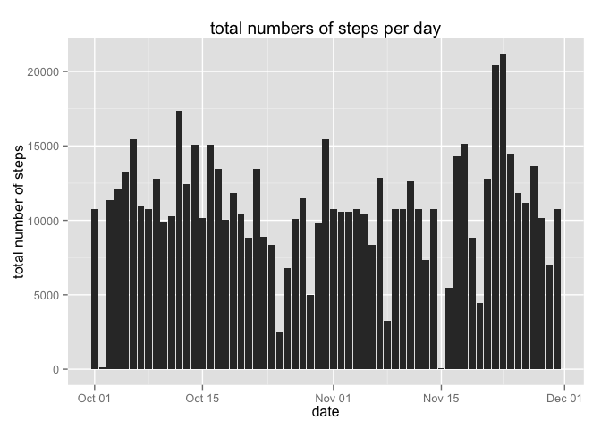
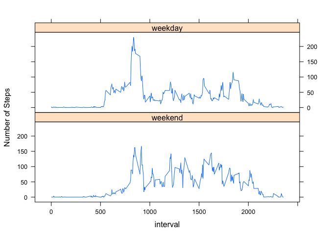

# Reproducible Research: Peer Assessment 1

Loading and preprocessing the data


```r
setwd("~/Documents/coursera/PA1_template")
data <- read.csv("./activity.csv", na.strings = "NA")
```

Transform the column date into a date.


```r
data$date <- as.Date(data$date, format = "%Y-%m-%d")
data$steps <- as.numeric(data$steps)
data$interval <- as.numeric(data$interval)
```

##What is the mean total number of steps taken per day?
using the plyr package and the ggplot2 package


```r
library(plyr)
z <- ddply(data, ~date, summarise, sum=sum(steps))
library(ggplot2)
ggplot(z, aes(x=date,y=sum)) + 
        geom_histogram(binwidth=.5, colour="black", fill="white") + 
        geom_bar(stat="identity") +
        xlab("date") +
        ylab("total number of steps") +
        ggtitle("total numbers of steps per day")
```

```
## Warning in loop_apply(n, do.ply): Removed 8 rows containing missing values
## (position_stack).
```

 

report the mean and median of the total number of steps taken per day

```r
x <- ddply(data, ~date, summarise, meanSteps=mean(steps), medianSteps=median(steps))
print(x)
```

```
##          date  meanSteps medianSteps
## 1  2012-10-01         NA          NA
## 2  2012-10-02  0.4375000           0
## 3  2012-10-03 39.4166667           0
## 4  2012-10-04 42.0694444           0
## 5  2012-10-05 46.1597222           0
## 6  2012-10-06 53.5416667           0
## 7  2012-10-07 38.2465278           0
## 8  2012-10-08         NA          NA
## 9  2012-10-09 44.4826389           0
## 10 2012-10-10 34.3750000           0
## 11 2012-10-11 35.7777778           0
## 12 2012-10-12 60.3541667           0
## 13 2012-10-13 43.1458333           0
## 14 2012-10-14 52.4236111           0
## 15 2012-10-15 35.2048611           0
## 16 2012-10-16 52.3750000           0
## 17 2012-10-17 46.7083333           0
## 18 2012-10-18 34.9166667           0
## 19 2012-10-19 41.0729167           0
## 20 2012-10-20 36.0937500           0
## 21 2012-10-21 30.6284722           0
## 22 2012-10-22 46.7361111           0
## 23 2012-10-23 30.9652778           0
## 24 2012-10-24 29.0104167           0
## 25 2012-10-25  8.6527778           0
## 26 2012-10-26 23.5347222           0
## 27 2012-10-27 35.1354167           0
## 28 2012-10-28 39.7847222           0
## 29 2012-10-29 17.4236111           0
## 30 2012-10-30 34.0937500           0
## 31 2012-10-31 53.5208333           0
## 32 2012-11-01         NA          NA
## 33 2012-11-02 36.8055556           0
## 34 2012-11-03 36.7048611           0
## 35 2012-11-04         NA          NA
## 36 2012-11-05 36.2465278           0
## 37 2012-11-06 28.9375000           0
## 38 2012-11-07 44.7326389           0
## 39 2012-11-08 11.1770833           0
## 40 2012-11-09         NA          NA
## 41 2012-11-10         NA          NA
## 42 2012-11-11 43.7777778           0
## 43 2012-11-12 37.3784722           0
## 44 2012-11-13 25.4722222           0
## 45 2012-11-14         NA          NA
## 46 2012-11-15  0.1423611           0
## 47 2012-11-16 18.8923611           0
## 48 2012-11-17 49.7881944           0
## 49 2012-11-18 52.4652778           0
## 50 2012-11-19 30.6979167           0
## 51 2012-11-20 15.5277778           0
## 52 2012-11-21 44.3993056           0
## 53 2012-11-22 70.9270833           0
## 54 2012-11-23 73.5902778           0
## 55 2012-11-24 50.2708333           0
## 56 2012-11-25 41.0902778           0
## 57 2012-11-26 38.7569444           0
## 58 2012-11-27 47.3819444           0
## 59 2012-11-28 35.3576389           0
## 60 2012-11-29 24.4687500           0
## 61 2012-11-30         NA          NA
```

## What is the average daily activity pattern?
Plotting a 5-minute interval steps vs the averaged number of steps taken across all days.


```r
    plot(data$date, data$steps, ylab="steps", xlab="date", type = "l")
        lines(x$date, x$meanSteps, col = "red")
        legend("topright", lty = 1:1 , col = c("black","red"), legend = c("5-minute interval","average per day"))
```

 

Find out which interval is containing on average the maximun number of steps


```r
DataMeanInterval <- ddply(data, ~interval, summarise, meanSteps=mean(steps, na.rm = TRUE))
        maxSteps <- max(DataMeanInterval[,2])        
        q <- DataMeanInterval$meanSteps == maxSteps
        IntervalMaximalNumberOfSteps <- DataMeanInterval[q,1]
        IntervalMaximalNumberOfSteps <- IntervalMaximalNumberOfSteps[!is.na(IntervalMaximalNumberOfSteps)]
print(IntervalMaximalNumberOfSteps)
```

```
## [1] 835
```

## Imputing missing values
To find the number of missing values in the dataset we will use the is.na function in combination with the sum function


```r
sum(is.na(data))
```

```
## [1] 2304
```

Create a new dataset where we're going to fill in the missing values of the dataset with the average of the mean of the 5 minutes interval

```r
dataNoNA <- data
n = 17568
for (i in 1:n) {
        if(is.na(dataNoNA[i,1]) == "TRUE") {
        z <- dataNoNA[i, 3]
        step <- DataMeanInterval$interval == z
        step <- DataMeanInterval[step,2]
        step <- step[!is.na(step)]
        dataNoNA[i,1] <- step
}
}
```

The histogram&mean and median are changing when there are no missing values present.


```r
z2 <- ddply(dataNoNA, ~date, summarise, sum=sum(steps))
ggplot(z2, aes(x=date,y=sum)) + 
        geom_histogram(binwidth=.5, colour="black", fill="white") + 
        geom_bar(stat="identity") +
        xlab("date") +
        ylab("total number of steps") +
        ggtitle("total numbers of steps per day")
```

 

```r
x <- ddply(dataNoNA, ~date, summarise, meanSteps=mean(steps), medianSteps=median(steps))
print(x)
```

```
##          date  meanSteps medianSteps
## 1  2012-10-01 37.3825996    34.11321
## 2  2012-10-02  0.4375000     0.00000
## 3  2012-10-03 39.4166667     0.00000
## 4  2012-10-04 42.0694444     0.00000
## 5  2012-10-05 46.1597222     0.00000
## 6  2012-10-06 53.5416667     0.00000
## 7  2012-10-07 38.2465278     0.00000
## 8  2012-10-08 37.3825996    34.11321
## 9  2012-10-09 44.4826389     0.00000
## 10 2012-10-10 34.3750000     0.00000
## 11 2012-10-11 35.7777778     0.00000
## 12 2012-10-12 60.3541667     0.00000
## 13 2012-10-13 43.1458333     0.00000
## 14 2012-10-14 52.4236111     0.00000
## 15 2012-10-15 35.2048611     0.00000
## 16 2012-10-16 52.3750000     0.00000
## 17 2012-10-17 46.7083333     0.00000
## 18 2012-10-18 34.9166667     0.00000
## 19 2012-10-19 41.0729167     0.00000
## 20 2012-10-20 36.0937500     0.00000
## 21 2012-10-21 30.6284722     0.00000
## 22 2012-10-22 46.7361111     0.00000
## 23 2012-10-23 30.9652778     0.00000
## 24 2012-10-24 29.0104167     0.00000
## 25 2012-10-25  8.6527778     0.00000
## 26 2012-10-26 23.5347222     0.00000
## 27 2012-10-27 35.1354167     0.00000
## 28 2012-10-28 39.7847222     0.00000
## 29 2012-10-29 17.4236111     0.00000
## 30 2012-10-30 34.0937500     0.00000
## 31 2012-10-31 53.5208333     0.00000
## 32 2012-11-01 37.3825996    34.11321
## 33 2012-11-02 36.8055556     0.00000
## 34 2012-11-03 36.7048611     0.00000
## 35 2012-11-04 37.3825996    34.11321
## 36 2012-11-05 36.2465278     0.00000
## 37 2012-11-06 28.9375000     0.00000
## 38 2012-11-07 44.7326389     0.00000
## 39 2012-11-08 11.1770833     0.00000
## 40 2012-11-09 37.3825996    34.11321
## 41 2012-11-10 37.3825996    34.11321
## 42 2012-11-11 43.7777778     0.00000
## 43 2012-11-12 37.3784722     0.00000
## 44 2012-11-13 25.4722222     0.00000
## 45 2012-11-14 37.3825996    34.11321
## 46 2012-11-15  0.1423611     0.00000
## 47 2012-11-16 18.8923611     0.00000
## 48 2012-11-17 49.7881944     0.00000
## 49 2012-11-18 52.4652778     0.00000
## 50 2012-11-19 30.6979167     0.00000
## 51 2012-11-20 15.5277778     0.00000
## 52 2012-11-21 44.3993056     0.00000
## 53 2012-11-22 70.9270833     0.00000
## 54 2012-11-23 73.5902778     0.00000
## 55 2012-11-24 50.2708333     0.00000
## 56 2012-11-25 41.0902778     0.00000
## 57 2012-11-26 38.7569444     0.00000
## 58 2012-11-27 47.3819444     0.00000
## 59 2012-11-28 35.3576389     0.00000
## 60 2012-11-29 24.4687500     0.00000
## 61 2012-11-30 37.3825996    34.11321
```

## Are there differences in activity patterns between weekdays and weekends?
create a newcolumn called wDay


```r
weekdays1 <- c('Monday', 'Tuesday', 'Wednesday', 'Thursday', 'Friday')
dataNoNA$wDay <-  factor((weekdays(dataNoNA$date) %in% weekdays1)+1L,
      levels=1:2, labels=c('weekend', 'weekday'))
```

panel plot


```r
z3 <- ddply(dataNoNA, .(interval,wDay), summarise, mean=mean(steps))
library(lattice)
xyplot(mean~interval | factor(wDay), data=z3, pch=19,
                xlab="interval",  ylab="Number of Steps",layout=c(1,2),type="l")
```

 
